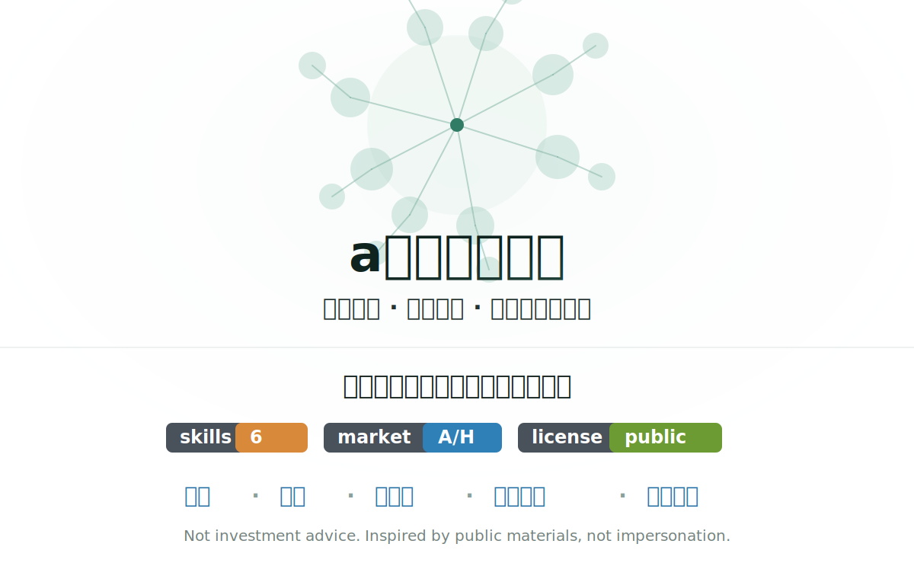

# a股金融梦之队

这是一个面向 Codex / AGENTS 生态的个人金融研究 skill 仓库，主题是把公开可见的投资者、创作者与经典投资思想整理成可复用的分析框架。

当前收录：

- `xueqiu-wunianguoyi`
- `bilibili-graham-laolin`
- `xueqiu-dayinwuyan`
- `xueqiu-jinrongjie-xingcang`
- `xueqiu-metalslime`
- `charlie-munger`

原则：

- 只使用公开可见资料、公开讨论页、公开搜索索引、公开视频页与常识性方法论整理。
- 不帮助绕过雪球等平台的反爬、风控或访问限制。
- 所有 skill 都是“受公开表达启发的分析框架”，不是对真人的冒充，也不是投资建议。

## 目录结构

- `skills/`：每个子目录是一套可加载 skill。
- `skills/*/SKILL.md`：主工作流、适用场景、输出格式和风险边界。
- `skills/*/references/`：公开画像、来源链接和整理依据。
- `workflow/skills/`：沉淀通用的 GitHub skill 仓库建设流程。

## 使用方式

把最贴近任务的 `SKILL.md` 加载给 Codex 类代理，再根据需要读取同目录下的 `references/`。如果任务跨风格，可以组合多个 skill，但所有结论都应回到原始资料和独立验证。
